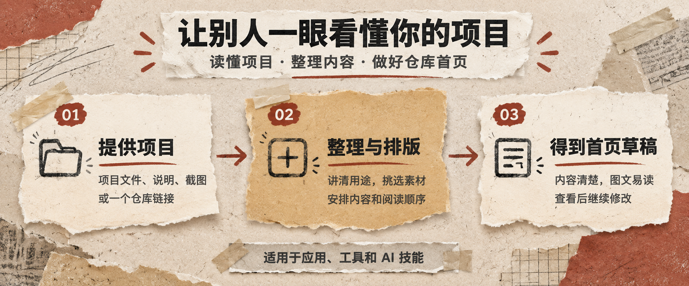

<h1 align="center">GitHub README Design</h1>

<p align="center">
  <strong>读懂项目，把 GitHub 仓库首页变成一张好看、好懂、能上手的产品说明。</strong>
</p>
<p align="center">
  <a href="https://github.com/AidenXu-1/github-readme-design/releases/latest"><strong>下载 Skill</strong></a> ·
  <a href="#开始使用">开始使用</a> ·
  <a href="#它会怎么处理一个项目">工作方式</a> ·
  <a href="https://github.com/AidenXu-1/github-readme-design/issues">问题反馈</a>
</p>

<p align="center">
  
</p>

## 一个 Skill，三件事

| 🔍 读懂项目 | 🎨 选对表达 | 📝 交付草稿 |
| :---: | :---: | :---: |
| 梳理用途、功能、安装入口和真实素材 | 根据项目特点安排首屏、图片和阅读顺序 | 生成可继续修改、可核对的 README |

## 你可以用它做什么

| 类型 | 适合的展示方式 | 典型任务 |
| --- | --- | --- |
| 🖥️ **应用** | Logo、真实界面、下载入口 | 重写首屏，补齐功能与安装说明 |
| ⌨️ **工具** | 输入输出、核心命令、使用示例 | 把技术说明整理成读者能跟着做的顺序 |
| 🧩 **Agent Skill** | 一次真实请求、处理过程、交付物 | 说清怎么安装、怎么调用、会得到什么 |

可以从头编写，也可以只更新某一部分。项目有现成 Logo、界面或作品时，优先使用真实素材；没有合适图片时，用排版和简单说明图把事讲清楚。

## 它会怎么处理一个项目

读取仓库 → 理清用途与读者 → 挑选真实素材 → 重组内容与版式 → 核对链接与事实 → **交付 README 草稿**

> 目标阅读路径：**这是什么 → 它能带来什么 → 效果如何 → 怎么开始**

## 开始使用

> 需要一个支持 Agent Skills、能读写项目文件的 AI 工具。Skill 本身无需额外运行程序。读取 GitHub 仓库时需要联网。

### ① 下载并安装

从[发布页](https://github.com/AidenXu-1/github-readme-design/releases/latest)下载 `github-readme-design-v1.1.0.zip`，解压后将整个 `github-readme-design` 文件夹放入 AI 工具的 Skills 目录。

Codex 的安装位置：

```text
~/.codex/skills/github-readme-design/SKILL.md
```

### ② 把项目交给 AI

附上仓库链接或本地项目文件夹，然后发送：

```text
使用 github-readme-design，重写这个项目的中文 README。
讲清用途和使用方法，优先用已有素材。
文案简洁，排版好看，先给我草稿。
```

<details>
<summary><strong>只想改一部分？</strong></summary>

```text
使用 github-readme-design，只更新安装说明。
保留其他内容和现有风格。
```

</details>

### ③ 查看草稿

草稿默认保存为 `README.draft.md`，新增图片会一并保存。有预览工具时，AI 会检查排版；查不清的信息会单独列出。

查看后可以继续修改。确认采用时，再要求替换正式 README 或推送到 GitHub。

## 交付原则

- ✅ 安装方式、功能和链接以项目实际内容为准
- ✅ 优先复用现有品牌与真实界面
- ✅ 排版兼顾 GitHub 深色、浅色背景和窄屏阅读
- ✅ 保留草稿确认环节，不自动发布

## 了解更多

[工作规则](SKILL.md) · [页面组织](references/page-guide.md) · [视觉与成本](references/visual-guide.md)
